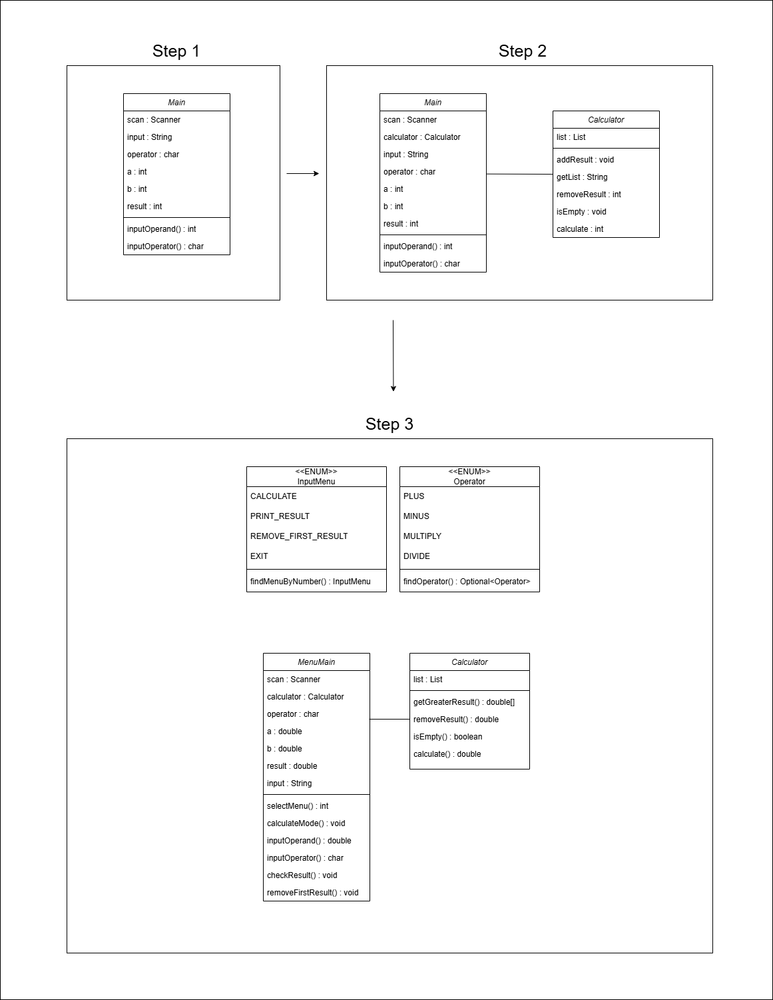

# 메뉴 기반 콘솔 계산기

콘솔에서 사칙연산을 수행하고, 계산 결과를 리스트에 저장/조회/삭제할 수 있는 계산기 프로젝트입니다.
추가로, 방금 계산한 결과보다 큰 계산 결과 값들만 필터링해서 출력하는 기능도 구현했습니다.

---

## 구조 (UML 클래스 다이어그램)

---

## 기능

 - 사칙연산 계산 (+, -, *, /)
 - 계산 결과 저장 (List<Double>)
 - 계산 결과 목록 조회
 - 첫 번째 계산 결과 삭제
 - 입력된 결과보다 큰 결과만 조회
 - 메뉴/연산자 Enum으로 입력 검증

---

## 메뉴

| 입력 | 메뉴            | 설명                                                           |
|---:|---------------|--------------------------------------------------------------|
|  1 | 계산하기          | 피연산자 2개 + 연산자를 입력받아 계산하고 결과 출력 및 저장 / 입력된 계산 결과보다 큰 계산 결과 출력 |
|  2 | 계산 결과 목록 조회   | 저장된 계산 결과 목록 조회                                              |
|  3 | 첫 번째 계산 결과 삭제 | 리스트의 첫 번째(0) 결과 삭제 후 목록 조회                                   |
|  0 | 종료            | 계산기 종료                                                       |

---

## 클래스 역할

| 클래스        | 역할                               |
|------------|----------------------------------|
| MenuMain   | Scanner 입력 처리 / 메뉴 선택 / 전체 흐름 제어 |
| Calculator | 계산 수행 / 결과 저장 / 조회 / 삭제 / 필터링    |
| InputMenu  | 메뉴 번호를 enum으로 매핑                 |
| Operator   | 연산자를 enum으로 매핑                   |

---

### 1) Calculator.calculate (제네릭 + enum 사용)

 - \<T extends Number>로 받아서 내부에서 double로 변환 후 연산한다.
 - ' / ' 연산에서 분모가 0이면 예외를 던진다.
 - 연산자가 잘못 들어오면 catch로 잡고, result 초기값(0)이 그대로 반환된다.

---

### 2) 계산 결과 저장 / 조회

 - 계산 결과는 List\<Double>에 누적 저장한다.
 - 결과 목록 출력은 toString() 기반으로 수행한다.
 - 결과가 비어있는지 여부는 isEmpty()로 체크한다.

---

### 3) 입력된 결과보다 큰 계산 결과만 필터링

 - 방금 계산한 result를 기준으로, 저장된 결과 중 더 큰 값만 골라서 반환한다.
 - Stream을 사용해 필터링 후, double[] 형태로 변환한다.
 - 결과가 없을 때는 예외 메시지로 안내한다.

---

### 4) 첫 번째 결과 삭제

 - 저장된 계산 결과 중 가장 먼저 들어온 값(0번째)을 삭제한다.
 - 삭제된 값을 반환해, 삭제된 원소를 확인할 수 있다.

---

### 예외 처리

| 상황                    | 처리 방식                        |
|-----------------------|------------------------------|
| 메뉴 입력이 숫자가 아닌 경우      | 숫자로 다시 입력하도록 메시지 출력 후 재입력    |
| 지원하지 않는 메뉴 번호를 입력한 경우 | "지원하지 않는 메뉴입니다." 출력 후 재입력    |
| 연산자 입력 오류             | "연산자가 잘못 입력되었습니다." 출력 후 재입력  |
| 나눗셈에서 분모가 0인 경우       | 예외 메시지를 출력 후, 계산을 계속 진행할지 확인 |
| 결과 목록이 비어있는데 조회/삭제 수행 | "현재 저장된 계산 결과가 없습니다." 메시지 출력 |

---

## 실행 흐름

1. 메뉴 출력 → 메뉴 번호 입력
2. 입력값을 InputMenu로 매핑해서 분기 처리
3. 기능 실행
   - 계산하기: 피연산자, 연산자 입력 → 계산 → 결과 출력(계산 결과 및 입력값보다 큰 계산 결과 목록) 및 저장  
   - 목록 조회: 저장된 계산 결과 출력
   - 첫 번째 계산 결과 삭제: 삭제 후 남은 결과 목록 출력
4. 종료(0) 선택 전까지 반복 수행

